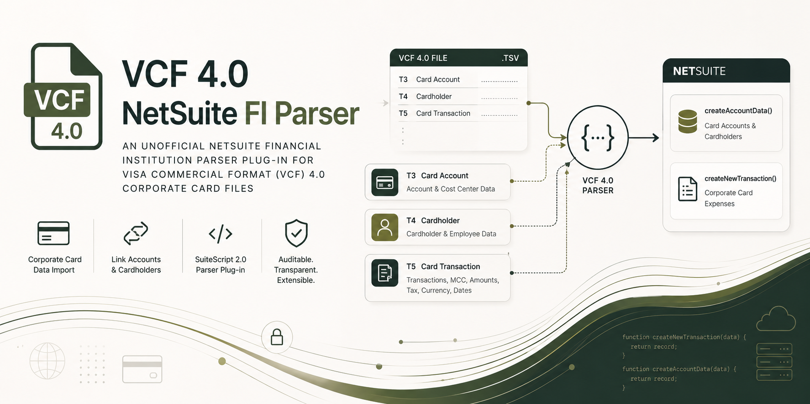

# VCF 4.0 NetSuite FI Parser

An unofficial NetSuite Financial Institution Parser plug-in for Visa Commercial Format (VCF) 4.0 corporate card files.

The parser reads VCF 4.0 variable-length tab-delimited files, links card transactions (T5) to card accounts (T3) and cardholders (T4), and emits NetSuite `createAccountData()` / `createNewTransaction()` records for Corporate Card Expenses format profiles.

## Status

Early release. The parser is usable as a starting point for VCF 4.0 corporate card imports, but you should test it against your issuer's real feed and your NetSuite expense workflow before production use.

## Quick Start

Clone the repo and run the synthetic fixture test:

```powershell
git clone https://github.com/braedonsaunders/vcf40-netsuite-fi-parser.git
cd vcf40-netsuite-fi-parser
npm test
```

Deploy the parser file to NetSuite:

```text
FileCabinet/SuiteScripts/vcf40_fi_parser.js
```

## What It Does

- Parses VCF 4.0 tab-delimited transaction-set files.
- Imports T5 Card Transaction records as NetSuite corporate card transactions.
- Uses T3 Card Account and T4 Cardholder records for cardholder and employee matching.
- Converts VCF `MMDDCCYY` dates to NetSuite ISO `YYYY-MM-DD`.
- Converts implied-decimal VCF amounts to NetSuite numbers.
- Signs credit transaction types as negative amounts.
- Maps numeric ISO currency codes such as `124` and `840` to `CAD` and `USD`.
- Provides a small MCC-to-expense-code bucket map for NetSuite expense category mapping.

## Why This Exists

Some commercial card issuers provide Visa spend feeds as VCF 4.0 files, while NetSuite's standard import options usually expect a supported bank/credit-card format or a custom Financial Institution Parser. This project gives NetSuite teams a small, auditable SuiteScript parser instead of forcing a separate VCF-to-CSV middleware transform.

## Not Included

- PGP decryption.
- SFTP connectivity.
- Bank-specific delivery setup.
- Real VCF sample files or Visa specification material.

Keep those outside this repository. VCF files can contain cardholder names, employee identifiers, and card/account numbers.

## Repository Layout

- `FileCabinet/SuiteScripts/vcf40_fi_parser.js` - SuiteScript 2.0 Financial Institution Parser plug-in.
- `test/vcf40_fi_parser.test.js` - local Node.js test harness that mocks the NetSuite parser context.
- `test/fixtures/minimal_vcf40_sample.tsv` - synthetic tab-delimited VCF-style fixture.

## NetSuite Setup

1. Upload `FileCabinet/SuiteScripts/vcf40_fi_parser.js` to the NetSuite File Cabinet.
2. Create a new Financial Institution Parser Plug-in implementation using that script.
3. Create or update a Financial Institution format profile.
4. Select the parser implementation for the Transaction Parser.
5. For employee expense workflows, use a Corporate Card Expenses profile.
6. Map the `VCF_*` expense codes to NetSuite expense categories.
7. Configure employee matching by `employeeId` when your VCF T4 Employee ID values match NetSuite external employee IDs. Otherwise, match by cardholder name or customize `createAccountData()`.

## Parsed VCF Records

The current parser uses these VCF records:

- T3 Card Account for account-to-cardholder linking and cost center metadata.
- T4 Cardholder for cardholder name, email, and employee ID.
- T5 Card Transaction for transaction dates, supplier data, amounts, tax, MCC, currency, and transaction type.

Other enhanced VCF records, such as lodging, fleet, passenger itinerary, and line-item details, are currently ignored. They can be added later by extending `parseVcf()` and `toNetSuiteTransaction()`.

## GL Account Mapping

The parser does not directly assign NetSuite GL accounts from the VCF card account number.

For Corporate Card Expenses imports, there are two separate mappings:

- Cardholder/card identity: the parser groups T5 transactions by VCF account number and calls `createAccountData()` with `accountId`, `cardHolder`, and `employeeId` when T3/T4 data is present. NetSuite uses the employee ID or cardholder name to link imported corporate card expenses to employees.
- Expense GL account: the parser emits an `expenseCode` such as `VCF_OFFICE`, `VCF_LODGING`, or `VCF_MEALS`. In NetSuite, map those codes on the format profile's Expense Code Mapping subtab to Expense Categories. Each Expense Category is linked to the GL expense account that will be debited.

The credit side is controlled by NetSuite's Corporate Card Expenses setup. NetSuite credits the selected corporate credit card account, which can come from Accounting Preferences, the employee record, or the expense report depending on your account configuration.

If you need one GL credit card account per physical card, configure that in NetSuite's employee/corporate card account setup or add a NetSuite-side customization after import. The VCF `accountId` is kept as the raw external card/account identifier; it is not a NetSuite GL account internal ID.

Oracle's docs confirm that corporate card imports use the Financial Institution Parser Plug-in interface and that `createNewTransaction()` must include `additionalFields.billedCurrencyISOCode` for corporate card data:

- [Financial Institution Parser Plug-in overview](https://docs.oracle.com/en/cloud/saas/netsuite/ns-online-help/chapter_159077938079.html)
- [Financial Institution Parser interface definition](https://docs.oracle.com/en/cloud/saas/netsuite/ns-online-help/chapter_159078912850.html)
- [Importing corporate card data](https://docs.oracle.com/en/cloud/saas/netsuite/ns-online-help/subsect_162885823036.html)

## Local Test

```powershell
npm test
```

Expected fixture result:

- `1` card account.
- `2` card transactions.
- Signed total: `$100.00`.
- One charge and one credit transaction.

You can run the harness against your own decrypted VCF file:

```powershell
node test/vcf40_fi_parser.test.js C:\path\to\decrypted-vcf-file.tsv
```

Do not commit real customer files.

## Customizing Expense Codes

The parser returns broad `VCF_*` expense code buckets from `getExpenseCodes()` and maps MCCs in `expenseCodeForMcc()`.

If you want one expense code per MCC, replace the bucket map with raw MCC codes and update `getExpenseCodes()`. If you want company-specific expense categories, keep the parser generic and do the mapping in the NetSuite format profile where possible.

## Contributing

Synthetic fixtures and focused parser improvements are welcome. Please do not submit real VCF files, issuer specs, card numbers, employee data, SFTP credentials, or PGP material.

## Notes

- This project is not affiliated with Visa, Oracle NetSuite, or any issuer.
- The synthetic test fixture is intentionally tiny and does not replace certification against your issuer's real feed.
- The parser is written as SuiteScript 2.0 because NetSuite's Financial Institution Parser Plug-in SDF support requires SuiteScript 2.0.
