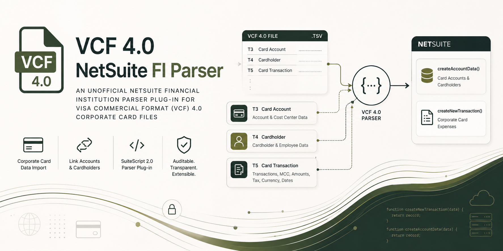

# VCF 4.0 NetSuite FI Parser

An unofficial NetSuite Financial Institution Parser plug-in for Visa Commercial Format (VCF) 4.0 corporate card files.

The parser reads VCF 4.0 variable-length tab-delimited files, links card transactions (T5) to card accounts (T3) and cardholders (T4), and emits NetSuite `createAccountData()` / `createNewTransaction()` records for Financial Institution format profiles. It is primarily intended for Bank Reconciliation imports where corporate card statement lines are matched against transactions that already exist in NetSuite.

## Status

Early release. The parser is usable as a starting point for VCF 4.0 corporate card statement imports, but you should test it against your issuer's real feed, account-linking setup, transaction-code mappings, and NetSuite reconciliation workflow before production use.

## Quick Start

Clone the repo and run the synthetic fixture test:

```powershell
git clone https://github.com/braedonsaunders/vcf40-netsuite-fi-parser.git
cd vcf40-netsuite-fi-parser
npm test
```

Deploy the parser file to NetSuite:

```text
FileCabinet/SuiteScripts/vcf40_fi_parser.js
```

## What It Does

- Parses VCF 4.0 tab-delimited transaction-set files.
- Handles normal CRLF-delimited records and issuer files that concatenate VCF records without CR/LF delimiters.
- Imports T5 Card Transaction records as NetSuite imported statement transactions.
- Uses T3 Card Account and T4 Cardholder records to group statement lines by external card account.
- Converts VCF `MMDDCCYY` dates to NetSuite ISO `YYYY-MM-DD`.
- Converts implied-decimal VCF amounts to NetSuite numbers.
- Signs credit transaction types as negative amounts.
- Maps numeric ISO currency codes such as `124` and `840` to `CAD` and `USD`.
- Preserves MCC category hints as `additionalFields.vcfExpenseBucket`; it does not emit `expenseCode` by default for Bank Reconciliation imports.
- Logs parser summaries and unexpected parser failures to the Financial Institution Parser Plug-in execution log.

## Why This Exists

Some commercial card issuers provide Visa spend feeds as VCF 4.0 files, while NetSuite's standard import options usually expect a supported bank/credit-card format or a custom Financial Institution Parser. This project gives NetSuite teams a small, auditable SuiteScript parser instead of forcing a separate VCF-to-CSV middleware transform.

## Not Included

- PGP decryption.
- SFTP connectivity.
- Bank-specific delivery setup.
- Real VCF sample files or Visa specification material.

Keep those outside this repository. VCF files can contain cardholder names, employee identifiers, and card/account numbers.

## Repository Layout

- `FileCabinet/SuiteScripts/vcf40_fi_parser.js` - SuiteScript 2.0 Financial Institution Parser plug-in.
- `test/vcf40_fi_parser.test.js` - local Node.js test harness that mocks the NetSuite parser context.
- `test/fixtures/minimal_vcf40_sample.tsv` - synthetic tab-delimited VCF-style fixture.

## NetSuite Setup

1. Upload `FileCabinet/SuiteScripts/vcf40_fi_parser.js` to the NetSuite File Cabinet.
2. Create a new Financial Institution Parser Plug-in implementation using that script.
3. Create or update a Financial Institution format profile.
4. Select the parser implementation for the Transaction Parser.
5. For reconciliation workflows, use a Bank Reconciliation profile.
6. On the Account Linking subtab, map each imported VCF account ID to the corresponding NetSuite bank or credit card GL account.
7. On the Code Type Mapping subtab, map `CHARGE` and `CREDIT` to the appropriate NetSuite bank data types.
8. If you intentionally adapt this parser for an employee-expense workflow, add the employee-expense-specific fields back into `createNewTransaction()` and map the `VCF_*` expense codes to NetSuite expense categories.

## Parsed VCF Records

The current parser uses these VCF records:

- T3 Card Account for account-to-cardholder linking and cost center metadata.
- T4 Cardholder for cardholder name, email, and employee ID.
- T5 Card Transaction for transaction dates, supplier data, amounts, tax, MCC, currency, and transaction type.

Other enhanced VCF records, such as lodging, fleet, passenger itinerary, and line-item details, are currently ignored. They can be added later by extending `parseVcf()` and `toNetSuiteTransaction()`.

## Bank Reconciliation Account Mapping

The parser does not directly assign NetSuite GL accounts from the VCF card account number.

For Bank Reconciliation imports, the GL mapping happens in NetSuite Account Linking:

- The parser groups T5 transactions by VCF card account number.
- For each VCF card account, the parser calls `createAccountData()` with `accountId` set to the T3 cardholder/account linking key when available, such as `220001` or another issuer-provided employee/card identifier.
- If an issuer does not provide a safe T3 linking key, the parser falls back to a stable redacted external ID, such as `VCF-1234-1A2B3C`.
- NetSuite uses that `accountId` on the Account Linking subtab, where you map the imported account to the corresponding NetSuite bank or credit card GL account.
- In this bank-reconciliation parser, `createAccountData()` intentionally does not pass `cardHolder` or `employeeId`. Those fields are for NetSuite's employee-expense corporate-card workflow and can cause imports to fail when the goal is statement reconciliation.

For a per-employee-card setup, create or use each employee's card as a NetSuite credit card GL account, then link the imported VCF account ID for that employee/card to the matching NetSuite credit card account. Existing expense reports and other posted transactions remain the book-side data. The imported VCF statement lines are the bank/card-side data used for matching and reconciliation.

`createAccountData()` does not create a persistent NetSuite GL account, employee record, or cardholder record. It creates an account data set for the current parser run, which is the container NetSuite expects before calling `createNewTransaction()`. Calling it once per VCF card account in each import is normal parser behavior.

For Bank Reconciliation, the important parser outputs are:

- `createAccountData({ accountId: ... })`, which supplies the redacted external account ID to link.
- `createNewTransaction({ date, amount, transactionTypeCode, uniqueId, ... })`, which supplies statement lines for NetSuite's Match Bank Data and reconciliation workflow.

The parser also includes cardholder, employee, MCC, and optional expense-bucket metadata where VCF provides it. That metadata can help with display, matching rules, or customizations, but it is not the GL-account mapping mechanism for Bank Reconciliation.

By default, `createNewTransaction()` emits a lean Bank Reconciliation payload:

- `id`
- `uniqueId`
- `date`
- `amount`
- `currency`
- `payee`
- `memo`
- `transactionTypeCode`
- `additionalFields.billedCurrencyISOCode`

Employee-expense-only fields such as `expenseCode`, `billedTaxAmount`, `localChargeAmount`, `localTaxAmount`, and `currencyExchangeRate` are intentionally not emitted by default because a Bank Reconciliation profile should not depend on Expense Code Mapping.

Oracle's docs describe the same Financial Institution Parser interface for both bank reconciliation and corporate card expense workflows. The downstream behavior is controlled by the NetSuite format profile type:

- [Financial Institution Parser Plug-in overview](https://docs.oracle.com/en/cloud/saas/netsuite/ns-online-help/chapter_159077938079.html)
- [Financial Institution Parser interface definition](https://docs.oracle.com/en/cloud/saas/netsuite/ns-online-help/chapter_159078912850.html)
- [createAccountData()](https://docs.oracle.com/en/cloud/saas/netsuite/ns-online-help/section_157867783812.html)
- [createNewTransaction()](https://docs.oracle.com/en/cloud/saas/netsuite/ns-online-help/section_159528925795.html)
- [Creating Format Profiles for Bank Reconciliation](https://docs.oracle.com/en/cloud/saas/netsuite/ns-online-help/section_1541610747.html)
- [Bank Account Linking](https://docs.oracle.com/en/cloud/saas/netsuite/ns-online-help/section_1541639171.html)

## Local Test

```powershell
npm test
```

Expected fixture result:

- `1` card account.
- `2` card transactions.
- Signed total: `$100.00`.
- One charge and one credit transaction.

You can run the harness against your own decrypted VCF file:

```powershell
node test/vcf40_fi_parser.test.js C:\path\to\decrypted-vcf-file.tsv
```

Do not commit real customer files.

## Customizing Expense Codes

The parser keeps broad `VCF_*` expense buckets in `additionalFields.vcfExpenseBucket` and exposes the same buckets through `getExpenseCodes()` for teams that adapt the parser to employee-expense workflows. A Bank Reconciliation profile should primarily rely on Account Linking and Code Type Mapping.

If you want one expense code per MCC, replace the bucket map with raw MCC codes and update `getExpenseCodes()`. If you want company-specific expense categories, keep the parser generic and do the mapping in the NetSuite format profile where possible.

## Contributing

Synthetic fixtures and focused parser improvements are welcome. Please do not submit real VCF files, issuer specs, card numbers, employee data, SFTP credentials, or PGP material.

## Notes

- This project is not affiliated with Visa, Oracle NetSuite, or any issuer.
- The synthetic test fixture is intentionally tiny and does not replace certification against your issuer's real feed.
- The parser is written as SuiteScript 2.0 because NetSuite's Financial Institution Parser Plug-in SDF support requires SuiteScript 2.0.
